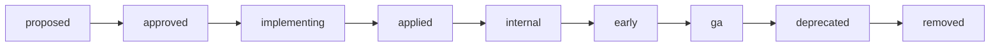

# ippoan-dev-plans

ippoan org 配下のリリース・機能開発を **plan として Issue で集中管理** する repo。

## 役割

- 各 plan は 1 Issue = 1 plan として作成 (label `plan` 必須)
- `stage:*` label で plan のライフサイクル (proposed → approved → implementing → applied → internal → early → ga → deprecated → removed) を表現
- consumer repo (rust-alc-api / auth-worker / nuxt-trouble / nuxt-notify / ci-dashboard) は本 repo の `manifests/production.snapshot.json` を取り込んで feature flag の真実とする
- `scripts/build-snapshot.js` / `check-snapshot.js` / `.githooks/pre-commit` は consumer repo にコピーして使う雛形

## ライフサイクル概要



詳細は [docs/plan-lifecycle.md](docs/plan-lifecycle.md) を参照。

## Plan を新規に立てる

1. https://github.com/ippoan/ippoan-dev-plans/issues/new/choose で 3 種類のテンプレートから選ぶ
   - **Plan: Feature** — feature flag を伴う新機能
   - **Plan: Bugfix** — flag を伴わない単純な修正
   - **Plan: Breaking** — expand/switch/contract が必要な互換性破壊変更
2. テンプレに従って `plan_id` (`YYYYMMDD_NNN_slug`)、`flag_name`、`scope`、YAML 定義などを記入
3. submit すると `plan` + `stage:proposed` + `type:*` label が自動付与される
4. レビュー → approve → `stage:approved` に移動 → 実装着手

## flag 命名規則

[docs/flag-conventions.md](docs/flag-conventions.md) を参照。要点:

- snake_case
- `<scope>_<feature>` (例: `alc_kiosk_v2`, `auth_passkey_login`, `trouble_ai_summary`)
- consumer repo のコードでは grep 可能なリテラルとして書く

## consumer repo の統合方法

scripts は npm package `@ippoan/dev-plans-snapshot` として公開している (GHCR registry)。

```bash
# 1. 認証 (一度だけ): ~/.npmrc などに
#    @ippoan:registry=https://npm.pkg.github.com
#    //npm.pkg.github.com/:_authToken=<PAT with read:packages>
#    consumer repo のルートに同内容の .npmrc を commit してもよい (token は env)

# 2. consumer repo に install
npm i -D @ippoan/dev-plans-snapshot

# 3. dev-plans.config.js (consumer repo ルート)
cat > dev-plans.config.js <<'EOF'
export default {
  scopeLabels: ['rust-alc-api', 'cross-repo'],          // この consumer に関係する plan のみ取得
  grepPatterns: [/\bif_flag!\(\s*"([a-z][a-z0-9_]+)#([a-f0-9]{8})"/g],  // 2 capture group: name, sha
  sourceDirs: ['src', 'crates'],                         // 言語/プロジェクト固有
};
EOF

# 4. package.json に script
#    "snapshot": "dev-plans-snapshot build",
#    "snapshot:check": "dev-plans-snapshot check"

# 5. 初期 snapshot 生成
GITHUB_TOKEN=$(gh auth token) npm run snapshot
git add manifests/production.snapshot.json

# 6. pre-commit hook を有効化
#    consumer repo の .githooks/pre-commit に snapshot:check を含めて
git config core.hooksPath .githooks
```

flag 識別子は `name#sha` ハイブリッド (sha = sha256(plan_id|id|source_issue) 先頭 8 桁)。同名 flag の事故を防ぎ、Issue rename / 番号変更を検知する。

## GitHub Project (kanban)

[ALC Release Pipeline](https://github.com/orgs/ippoan/projects/1) で全 plan を column 形式で可視化。

- **Stage** カスタム field (single-select) が 9 stage を表現:
  Proposed / Approved / Implementing / Applied / Internal / Early / GA / Deprecated / Removed
- 標準の **Status** field (Todo / In Progress / Done) は別軸の workflow indicator として残す
- Board view で Stage を group-by すると 9 column のカンバンになる

card の Stage 変更 → `stage:*` label 自動付与の同期は未実装。当面手動運用 (`gh issue edit <N> --add-label stage:approved` 等)。将来的に `.github/workflows/sync-project-labels.yml` で完全自動化予定。

新規 plan Issue を作成すると自動で Project に追加されるよう、Project の builtin workflow "Auto-add to project" を [Project の Workflows 設定](https://github.com/orgs/ippoan/projects/1/workflows) から有効化することを推奨 (UI 操作のみ可)。

## Snapshot scripts (`@ippoan/dev-plans-snapshot`)

| CLI | 役割 |
|---|---|
| `dev-plans-snapshot build` | GitHub API から `label:plan` の Issue を fetch → `manifests/production.snapshot.json` 生成 (per-flag SHA 付き) |
| `dev-plans-snapshot check` | drift 検出 + コードの `if_flag!("name#sha")` 参照が snapshot に存在するか + removed flag の残存確認 |

リリースは `scripts/snapshot-pkg-v*` タグを push すると `.github/workflows/publish.yml` が GHCR registry へ npm publish する。

## Pre-commit hook

`.githooks/pre-commit` を `git config core.hooksPath .githooks` で有効化すると、commit 前に `check-snapshot.js` が走り snapshot drift / flag 漏れを検出する。

## 関連 repo

| repo | 役割 |
|---|---|
| `ippoan/rust-alc-api` | Rust backend (Cloud Run) |
| `ippoan/auth-worker` | OAuth ハンドラ (Cloudflare Workers) |
| `ippoan/nuxt-trouble` | トラブル管理 frontend (Nuxt) |
| `ippoan/nuxt-notify` | 通知配信 frontend (Nuxt) |
| `ippoan/ci-dashboard` | CI / Issue 集約 |

## 運用ルール

- main は **commit 必ず PR 経由** (初回 bootstrap commit を除く)
- close した Issue (= plan) も snapshot に反映される (state: all で fetch)。snapshot 上で削除されるのは `stage:removed` label が付き かつ コードからも参照が消えてから

## License

Internal use only.
