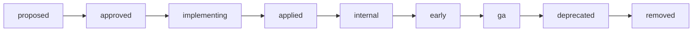

# ippoan-dev-plans

ippoan org 配下のリリース・機能開発を **plan として Issue で集中管理** する repo。

## 役割

- 各 plan は 1 Issue = 1 plan として作成 (label `plan` 必須)
- `stage:*` label で plan のライフサイクル (proposed → approved → implementing → applied → internal → early → ga → deprecated → removed) を表現
- consumer repo (rust-alc-api / auth-worker / nuxt-trouble / nuxt-notify / ci-dashboard) は本 repo の `manifests/production.snapshot.json` を取り込んで feature flag の真実とする
- `scripts/build-snapshot.js` / `check-snapshot.js` / `.githooks/pre-commit` は consumer repo にコピーして使う雛形

## ライフサイクル概要



詳細は [docs/plan-lifecycle.md](docs/plan-lifecycle.md) を参照。

## Plan を新規に立てる

1. https://github.com/ippoan/ippoan-dev-plans/issues/new/choose で 3 種類のテンプレートから選ぶ
   - **Plan: Feature** — feature flag を伴う新機能
   - **Plan: Bugfix** — flag を伴わない単純な修正
   - **Plan: Breaking** — expand/switch/contract が必要な互換性破壊変更
2. テンプレに従って `plan_id` (`YYYYMMDD_NNN_slug`)、`flag_name`、`scope`、YAML 定義などを記入
3. submit すると `plan` + `stage:proposed` + `type:*` label が自動付与される
4. レビュー → approve → `stage:approved` に移動 → 実装着手

## flag 命名規則

[docs/flag-conventions.md](docs/flag-conventions.md) を参照。要点:

- snake_case
- `<scope>_<feature>` (例: `alc_kiosk_v2`, `auth_passkey_login`, `trouble_ai_summary`)
- consumer repo のコードでは grep 可能なリテラルとして書く

## consumer repo へのコピー方法

```bash
# rust-alc-api / auth-worker 等で
mkdir -p scripts manifests .githooks
cp /path/to/ippoan-dev-plans/scripts/{build-snapshot.js,check-snapshot.js,package.json} scripts/
cp /path/to/ippoan-dev-plans/.githooks/pre-commit .githooks/
git config core.hooksPath .githooks

# 言語別に check-snapshot.js の grep パターンを編集
# - Rust:     `if_flag!("xxx")` 形式
# - Vue/TS:   `useFeatureFlag('xxx')` 形式

# 初期 snapshot 生成
GITHUB_TOKEN=$(gh auth token) node scripts/build-snapshot.js \
  --owner ippoan --repo ippoan-dev-plans
git add manifests/production.snapshot.json && git commit -m "chore: add initial snapshot"
```

## GitHub Project (kanban)

[ALC Release Pipeline](https://github.com/orgs/ippoan/projects/1) で全 plan を column 形式で可視化。

- **Stage** カスタム field (single-select) が 9 stage を表現:
  Proposed / Approved / Implementing / Applied / Internal / Early / GA / Deprecated / Removed
- 標準の **Status** field (Todo / In Progress / Done) は別軸の workflow indicator として残す
- Board view で Stage を group-by すると 9 column のカンバンになる

card の Stage 変更 → `stage:*` label 自動付与の同期は未実装。当面手動運用 (`gh issue edit <N> --add-label stage:approved` 等)。将来的に `.github/workflows/sync-project-labels.yml` で完全自動化予定。

新規 plan Issue を作成すると自動で Project に追加されるよう、Project の builtin workflow "Auto-add to project" を [Project の Workflows 設定](https://github.com/orgs/ippoan/projects/1/workflows) から有効化することを推奨 (UI 操作のみ可)。

## Snapshot scripts

| script | 役割 |
|---|---|
| `scripts/build-snapshot.js` | GitHub API から `label:plan` の Issue を全 fetch → `manifests/production.snapshot.json` 生成 |
| `scripts/check-snapshot.js` | snapshot の `issues_last_updated_at` と GitHub API 上の最新 updatedAt を比較 → drift 検出 / コードが参照する flag が snapshot に存在するか / removed flag が残ってないか確認 |

両 script は **consumer repo にコピーして使う雛形**。詳細はファイル冒頭のコメント参照。

## Pre-commit hook

`.githooks/pre-commit` を `git config core.hooksPath .githooks` で有効化すると、commit 前に `check-snapshot.js` が走り snapshot drift / flag 漏れを検出する。

## 関連 repo

| repo | 役割 |
|---|---|
| `ippoan/rust-alc-api` | Rust backend (Cloud Run) |
| `ippoan/auth-worker` | OAuth ハンドラ (Cloudflare Workers) |
| `ippoan/nuxt-trouble` | トラブル管理 frontend (Nuxt) |
| `ippoan/nuxt-notify` | 通知配信 frontend (Nuxt) |
| `ippoan/ci-dashboard` | CI / Issue 集約 |

## 運用ルール

- main は **commit 必ず PR 経由** (初回 bootstrap commit を除く)
- close した Issue (= plan) も snapshot に反映される (state: all で fetch)。snapshot 上で削除されるのは `stage:removed` label が付き かつ コードからも参照が消えてから

## License

Internal use only.
